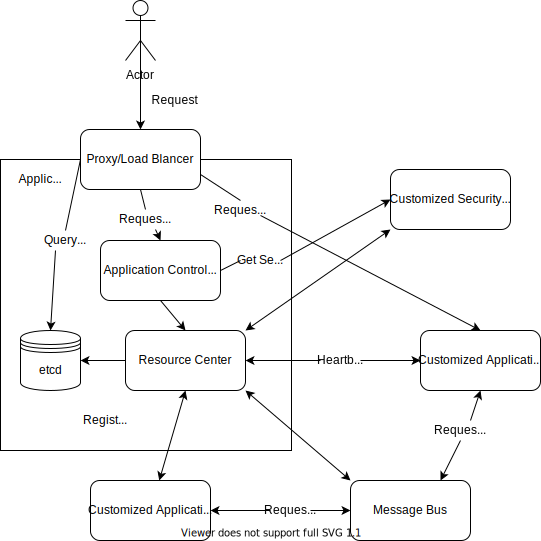

# 一种 Rust 中插件系统的设计
## 概述
根据《在 Rust 中实现插件系统方案分析与选择》一文中的结论得出的初步设计方案，模仿 Kubernetes 实现。

## 技术选择
| 组件         | 名称        |
| :----------- | ----------- |
| 数据库       | etcd        |
| 数据库连接器 | etcd-client |
| gRPC 实现    | tonic       |
| 异步 I/O     | tokio       |
| HTTP        | rocket       |

## 架构设计

